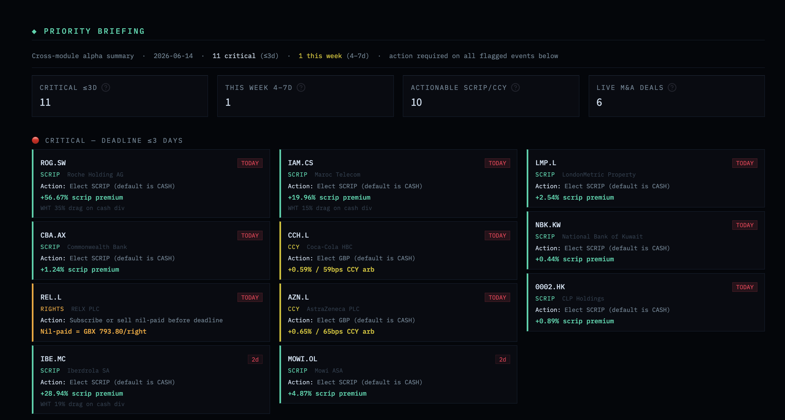

# ◆ CA Alpha Dashboard

**Live app:** [ca-alpha-dashboard.streamlit.app](https://ca-alpha-dashboard.streamlit.app)  
**Stack:** Python · Streamlit · SQLite · Pandas · Plotly

A CA desk decision tool built to demonstrate corporate actions analytics methodology across nine modules. Most CA tools stop at showing an event list. This one adds the decision layer: for each event type, what action is needed, what is the value of taking it, and what does doing nothing cost.


<sub>Priority Briefing: the cross-module morning brief ranking every action-required election by urgency and alpha.</sub>

---

## What it does

The system covers a synthetic universe of live and upcoming events across 36 countries. For each event type a valuation model runs, actionable opportunities are ranked by urgency and alpha, outcomes are tracked after elections close, and a cross-module morning brief pulls everything into one view.

---

## Modules

### ◆ Event Pipeline / Deadline Manager
Live event tracker with deadline countdown chart, urgency traffic lights (red ≤3d / amber ≤7d / yellow ≤14d / green), passed deadlines section, and alpha flags. Top 30 most urgent events in the chart by default, with a show-all toggle. Filters by status, event type, category, and country.

### ◆ Scrip Arbitrage Engine
Multi-name scrip dividend engine covering the full election decision:

```
Scrip_value    = (N_new ÷ N_existing) × P_current
Cash_net       = Cash_gross × (1 − WHT%)
Premium%       = (Scrip_value − Cash_net) ÷ Cash_net × 100
Break_even_px  = Cash_net ÷ (N_new ÷ N_existing)
Action_req     = election_default ≠ optimal_election
```

Covers withholding tax drag (0% WHT shown explicitly rather than silently hidden), break-even analysis, lender conflict and recall assessment with T−2 recall deadlines calculated dynamically from record date, and position-level P&L. Scanner shows all live events ranked by urgency with action flags.

### ◆ CCY Election Optimiser: Pre-Deadline Fixed Rate Only
Currency election analysis. The defining analytical choice: only events where the company announced a fixed FX reference rate *before* the election deadline are shown. This locks in the arbitrage against spot. Events where the rate is set at or after the deadline are excluded. Those represent currency preference, not arbitrage.

```
Arb%             = (Co_rate ÷ Mkt_rate − 1) × 100
Arb_bps          = Arb% × 100
Cost_of_inaction = Uplift_per_share × N_shares
```

Roughly half of CCY elections in the universe pass the filter. The scanner ranks by arb bps, shows cost of inaction at position size, and flags events where the default election forfeits the arb.

### ◆ Rights Issue Analyser
TERP from first principles, nil-paid valuation, and a three-way portfolio payoff comparison:

```
TERP           = (N_existing × P_cum + N_new × Sub_price) ÷ (N_existing + N_new)
Nil_paid       = max(0, TERP − Sub_price)
Disc_to_TERP   = Sub_price ÷ TERP − 1
Dilution_max   = N_new ÷ (N_existing + N_new)
Recall_by      = Record_date − 2 business days  [calculated dynamically, weekday-aware]
```

Portfolio payoff chart shows take-up vs sell nil-paid vs lapse at the sidebar position size, with P&L callouts at current price. Scanner sorted by urgency first, then discount depth within the same deadline bucket.

### ◆ Tender Tracker
Proration modelling, annualised return ranking, Dutch auction expected value, and odd lot arbitrage:

```
Ann_return     = Spread% ÷ Days_to_deadline × 365
Eff_premium    = (Acc × Tender_px + Ret × Market_px) ÷ N_tendered − Market_px
EV_dutch       = P(fill) × (Exp_clearing − Market_px) × N × Proration_rate
Odd_lot_P&L    = (Tender_px − Market_px) × N_shares  [guaranteed fill, zero proration risk]
```

Dutch auction EV uses a uniform clearing distribution. In an issuer Dutch tender the holder names the minimum price they will accept and is filled when the clearing price is at or above that bid, so P(fill) = (ceiling − bid) ÷ (ceiling − floor) and the expected clearing conditional on fill = (bid + ceiling) ÷ 2. Scanner ranks all live tenders by proration-adjusted annualised return. Odd lot thresholds flag guaranteed-fill sub-positions as a separate arb from the main proration position.

### ◆ Merger & Scheme Tracker
Implied probability model, reward:risk framing, and consideration election optimisation:

```
p (implied)    = |Break%| ÷ (Spread% + |Break%|)   [derived from EV = 0 at market price]
Ann_return     = Spread% ÷ Days_to_sanction × 365   [actual court date, not sidebar assumption]
Reward:Risk    = Spread% : |Break%|                  [standard arb desk framing]
```

Annualised returns use actual days to court sanction date per deal where available, falling back to the user-input assumption only when no date is set. Deals where the sanction date has passed show "SETTLING" rather than a misleading annualised figure. Bubble chart plots spread vs implied probability for all live deals, sized by break risk.

### ◆ Closed Events: Trade Outcomes
Post-deadline lifecycle view classifying each closed election:
- **Alpha Captured**: non-default election was available and would have been taken
- **Neutral / Default**: default election was already optimal; no action needed
- **Rights Lapsed**: rights lapsed or deadline missed

Without this page the system only shows signals before elections. With it, the feedback loop closes: outcomes tracked after the deadline, showing whether the model recommendation was right.

### ◆ Priority Briefing
Cross-module morning brief pulling all nine modules into one prioritised view:

- **Critical (≤3d):** Events requiring instruction today or imminently. Each card shows event type, exact action, and quantified value (scrip premium %, CCY arb bps, tender annualised return, nil-paid value per right).
- **This Week (4–7d):** Elections closing this week.
- **Active M&A Monitoring:** Live merger and scheme positions with spread, annualised return, regulatory clearance status, and acquirer.

Full action list table at the bottom with colour-coded urgency.

### ◆ ADR / Cross-Listed Pricing
Conversion-adjusted price comparison between primary listing and US ADR or secondary exchange listing:

```
Local_USD      = Local_px × spot_FX       [e.g. GBX × 0.012647 for GBPUSD = 1.2647]
Implied_local  = ADR_price ÷ ADR_ratio
Gross_arb%     = (Implied_local − Local_USD) ÷ Local_USD × 100
Net_arb%       = Gross_arb% − Round_trip_friction%
Action flag    = |net_arb| ≥ 0.10%
```

10 pairs: 8 UK ADR pairs (BP, Shell, AZN, GSK, HSBC, BAT, Unilever, Rio Tinto ADR) and 2 dual-primary cross-listings (BHP and Rio Tinto LSE/ASX). ADR arbs typically ±0.2–0.6% gross; cross-listing spreads 1.7–3.0% (structural, due to different shareholder bases, Australian franking credits, and cross-currency settlement mechanics). Deep-dive shows the arb waterfall chart, full price breakdown, and trade direction.

---

## Architecture

```
CA Project/
├── Home.py                      ← Entry point; Top Opportunities Now strip; 9-module grid
├── rebase_dates.py              ← Weekly date maintenance (incremental delta, stored in meta)
├── build_events_db_v2.py        ← Full DB rebuild from scratch
├── add_past_urgent_events.py    ← Seeds closed/urgent demo events; auto-detects DB shift
├── fix_db_overrebase.py         ← Corrects cumulative rebase drift if run multiple times
├── data/
│   └── events.db                ← SQLite; 233 events across 8 tables
├── pages/
│   ├── 1_Event_Pipeline.py
│   ├── 2_Scrip_Arbitrage.py
│   ├── 3_CCY_Election.py
│   ├── 4_Rights_Issue.py
│   ├── 5_Tender_Tracker.py
│   ├── 6_Merger_Tracker.py
│   ├── 7_Closed_Events.py
│   ├── 8_Priority_Briefing.py
│   └── 9_ADR_Pricing.py
└── utils/
    ├── __init__.py              ← Convenience re-exports for page modules
    ├── helpers.py               ← sf, fmt_date, days_to, ann_ret, colour helpers
    └── ui.py                    ← apply_theme(), dark_table() with sort JS
```

**DB schema (8 tables):**

| Table | Rows | Contents |
|---|---|---|
| `events` | 281 | Core event data: ticker, type, status, dates, currency |
| `scrip_details` | 92 | Scrip/CCY: cash amt, ratio, WHT, FX rates, election default/optimal |
| `rights_details` | 69 | TERP, sub price, nil-paid, discount, underwriter |
| `tender_details` | 63 | Tender/Dutch: price, premium, proration, odd lot threshold |
| `merger_details` | 27 | Spread, break risk, acquirer, regulatory status, sanction date |
| `spinoff_details` | 7 | Ratio, record date, spin-co details |
| `split_details` | 16 | Ratio, type (split/consolidation) |
| `meta` | 1 | Last rebase date (prevents cumulative drift) |

Dutch auction events use `tender_details` with `tender_type = 'DUTCH_AUCTION'`. CCY elections use `scrip_details` with `rate_pre_deadline` flag.

---

## Running locally

```bash
git clone https://github.com/JohnPatman/CA-Alpha-Dashboard
cd CA-Alpha-Dashboard
pip install -r requirements.txt
streamlit run Home.py
```

The SQLite database (`data/events.db`) is included in the repository. No external data feeds or API keys required.

To rebuild the database from scratch:
```bash
python3 build_events_db_v2.py    # rebuilds events.db from synthetic data
python3 add_past_urgent_events.py  # seeds closed/urgent demo events
python3 rebase_dates.py           # shifts dates to today
```

---

## Key design decisions

**CCY pre-deadline filter.** Of the CCY elections in the universe, roughly half are excluded because the company sets the FX reference rate at or after the election deadline, meaning there is no locked-in arb, just currency preference. Including them would inflate the opportunity count and misrepresent the economics. The filter is explained prominently in the module rather than buried in small print.

**TERP from first principles, not DB lookup.** Every rights issue calculation uses `(N_existing × P_cum + N_new × Sub_price) ÷ (N_existing + N_new)` from live price and stored subscription price, falling back to the stored value only if either is missing. The check uses `is not None` rather than truthiness: a zero subscription price is valid data, not a missing value, and a naive `if sub_px` would silently fall back to a stale DB figure for zero-price events.

**Merger ann return from actual deal days.** The annualised return in the scanner uses `julianday(court_sanction_date)` per deal rather than a single user-input assumption applied uniformly. A deal with a sanction date 14 days away and a deal with a sanction date 180 days away should not show the same annualised return for the same spread. Deals past their sanction date are flagged "SETTLING"; showing a live annualised return at that point is misleading.

**Lender recall as a first-class concern.** Both scrip and rights modules compute the recall deadline dynamically as `record_date − 2 business days` (weekday-aware). Most CA tools treat this as a footnote. For a securities lending desk or a long-short fund with shares on loan, the recall deadline is operationally the most important date on the card: missing it forfeits the entire election alpha.

**Rebase correctness.** The original implementation applied `(today − original_build_date)` as the offset on each weekly run, causing dates to drift by a compounding multiple of the original offset. The fix stores the last-run date in a `meta` table and applies only the incremental delta each time, so each weekly run shifts dates forward by exactly 7 days regardless of when the original build happened.

---

## Data

All companies, tickers, prices, spreads, FX rates, ratios, and deadlines are **entirely synthetic**, generated for illustrative purposes only. They do not represent real corporate actions or real securities. Nothing on this dashboard constitutes investment advice or should be relied upon for any financial, legal, or investment decision.

The dataset is structured to be realistic in character: event types, geography, corporate action mechanics, and pricing relationships reflect genuine market conventions, while all specific values are fabricated.

---

## About

Built by John Patman.

This project was built independently in personal time. All views and methodologies are the author's own and do not represent the views of any current or former employer.
